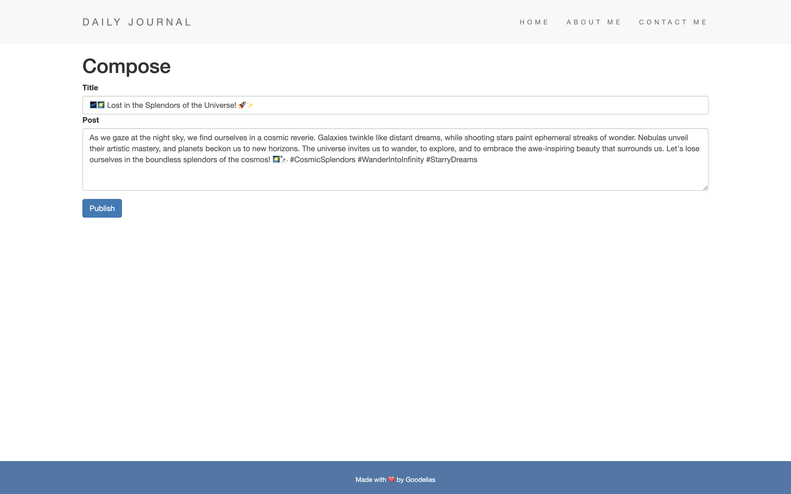
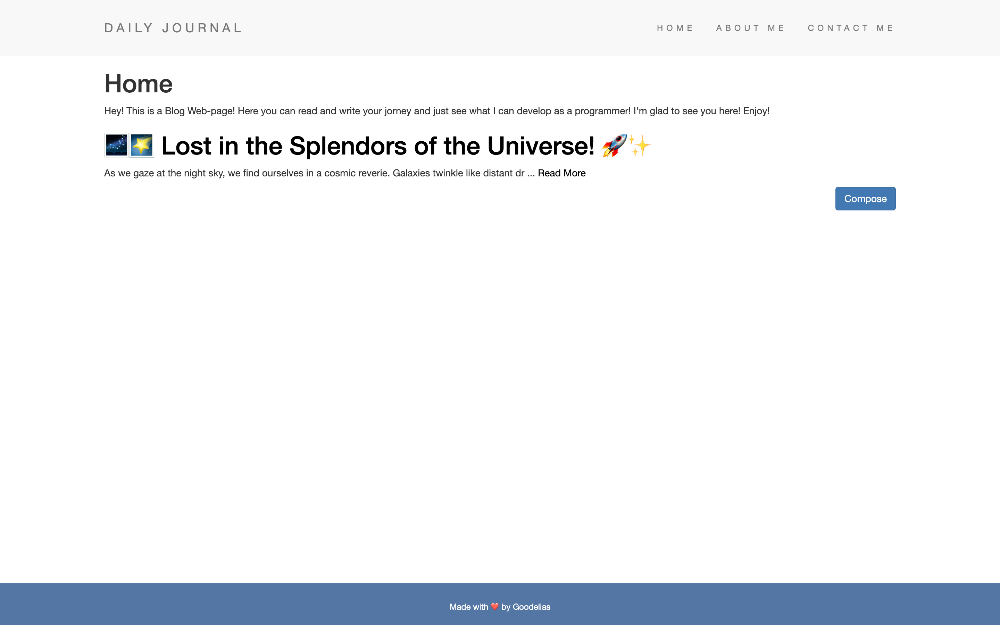
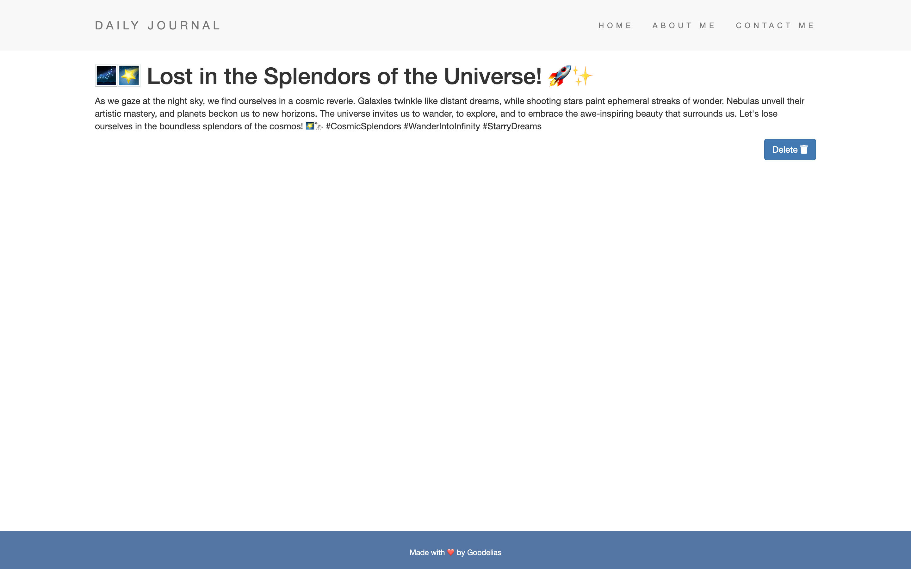

# SimpleBlog - Effortless Blogging Made Simple

## Table of contents

- [Introduction](#introduction)
- [Demo](#demo)
- [Technology](#technology)
- [Features](#features)
- [Run](#run)

## Introduction

Welcome to SimpleBlog, a no-frills blog website created using Node.js, Express, and Mongoose. This project offers a straightforward platform for users to view, create, and delete their posts hassle-free.

## Demo

## Technology

The main technologies used to build this application are:

- Node.js
- Express.js
- Mongoose
- REST API

## Features

**A SimpleBlog with following features:**

- Streamlined Blogging Experience
SimpleBlog provides an intuitive interface for bloggers of all levels. It focuses on core blogging features, making writing and sharing posts quick and easy.

- Write and Share Instantly:
With SimpleBlog, you can instantly create and publish your posts. Share your thoughts, ideas, and stories with a wider audience effortlessly.

- Start Your Blogging Journey:
Get started with SimpleBlog today. Whether you're writing for personal fulfillment or engaging with readers, this platform simplifies your blogging experience, so you can focus on what matters most - your content.

## Run

- Open the project and navigate to server folder. Create ".env" file. Write MONGO_URL as variable name and put your own mongodb url as a value, previously generated in your mongodb account.
- run in the console "npm install" to set up an existing npm package. Then run "node app.js" to start the app.

Then the Blog app should start.