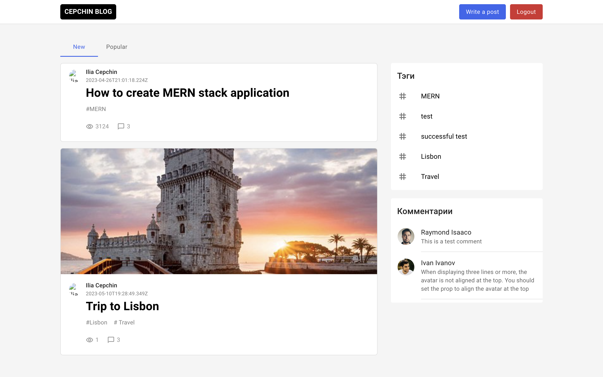
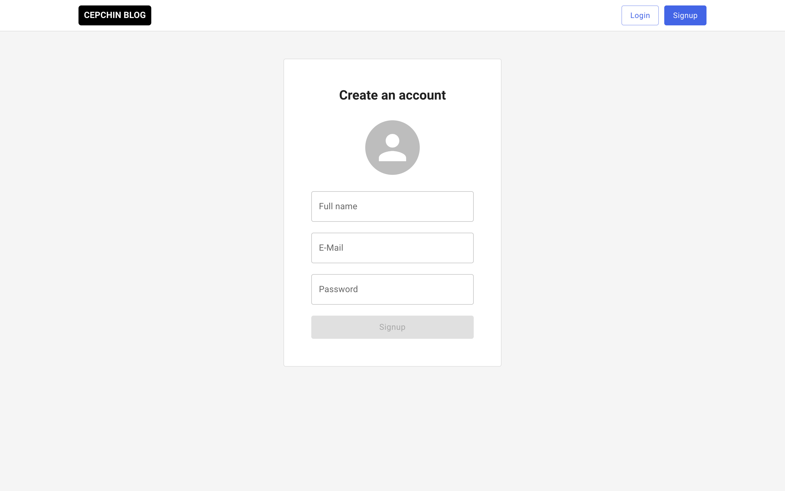

# MERN-Blog

## Table of contents

- [Introduction](#introduction)
- [Demo](#demo)
- [Technology](#technology)
- [Features](#features)
- [Run](#run)

## Introduction

Introducing "Blog," a powerful web application built using the MERN stack—MongoDB, Express.js, React.js, and Node.js. This feature-rich platform allows both logged-in and unlogged users to explore an extensive collection of blog posts, view detailed content and comments, sign up, and engage in the full blogging experience.

Logged-in users can enjoy additional benefits such as seamless login/logout functionality, creating, editing, and deleting posts, ensuring a personalized and interactive journey.

With its intuitive interface and seamless user experience, Blog offers a comprehensive solution for readers and writers alike, harnessing the capabilities of the MERN stack to foster engagement and idea-sharing in the blogging world.

## Demo

<!-- This application is deployed on Heroku and can be accessed through the following link:

[MERN Blog on Heroku](https://mern-blog-01.herokuapp.com/)
 -->
## Technology

The main technologies used to build this application are:

- Node.js 
- MongoDB 
- Express.js 
- React.js 

## Features

A blog app with the following features.

Unlogged in users can do the following:

- View all posts.
- View one post's content by clicking on it.
- View post's comments.
- Signup.

In addition to the above points, logged in users can do the following:

- Login or logout.
- Create a new post.
- View/Edit/delete their posts.

## Run

To run this application (the master branch), You have to run the client and server together. First you have to clone the frontend part repository via this link [MERN-blog-frontend](https://github.com/goodelias/goodelias.github.io/tree/master/mern-blog-frontend). Since you have both parts of the project we can start set everything up to run the app.

**Backend**

Open the server part of the project and set your own environmental variables in the server root folder. For security reasons, some variables have been hidden from view and used as environmental variables with the help of dotenv package. Below are the variables that you need to set in order to run the server:

- MONGO_URI: this is the connection string of your MongoDB Atlas database.

- SECRET_KEY: you can provide any string here, it is used to encrypt the JWT authentication token.

- PORT: provide any port you want this application to run on

After you've set these environmental variables in the .env file at the root of the server folder, run "node index.js" to run the server.

**Frontend**

Open frontend part and run in the console "npm init" to set up an existing npm package. Then run "npm start" to start the client.

And now the application should start.
